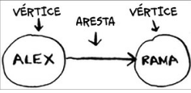
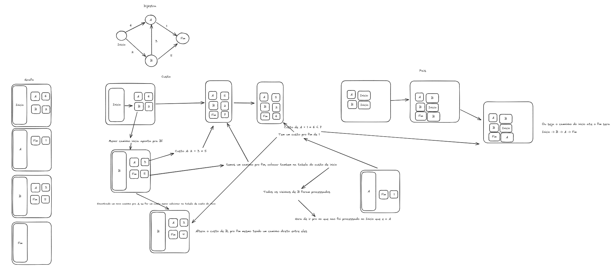
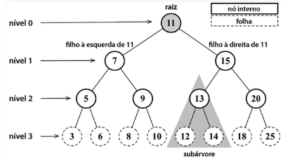
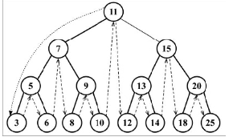
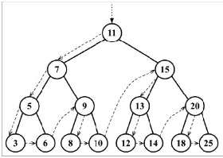
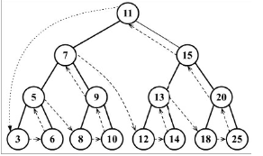

# Algoritmos em Typescript

- Seguindo o livro "Entendendo algoritmos"

Usando:

[](https://typescriptlang.org)

## Test Report

Esse projeto, usa o vitest pra testar o codigo, seu report atualizado pode ser visto [aqui](https://hiaguedes.github.io/algorithms-book)

## Anotacoes

### Notacao Big O

- A notacao tem esse nome por que conta quantas operacoes foram feitas e nao o tempo de execucao, ja q o tempo depende do ciclo de maquina do processador, oq e diferente de um computador pra outro

- A notacao big O leva sempre em consideracao o pior caso, ou seja se percorro um array de n posicoes e tenho o pior caso entao tenho n operacoes pra fazer, ou seja O(n)

- Constantes sao ignorados na notacao, entao se uma notacao tem complexidade O(n^2 / 2) ou O(n^2 + 1) nao importa, no fim elas sao O(n^2), a notacao big O se preocupa mais quando existem uma quantidade massiva de dados a constante nao afeta tanto em comparacao com 4 bilhoes de dados

### Listas e arrays

- Array voce precisa criar espaco na memoria pra inserir todas elas juntas, as listas um elemento aponta para o proximo

- Lista tem complexidade leitura de O(n) e de insercao 0(1), array tem complexidade de leitura O(1) e de insercao de O(n)

- Listas sao melhores pra inserir informacao no meio delas

- Uma lista e melhor pra deletar elementos tbm, pois somente precisa mudar pra onde o elemento anterior vai  

### Recursividade

- Voce sabe mas recursividade tem o caso recursivo q e pra chamar a si mesmo caso esse caso seja verdadeiro e o caso base pra quebrar a recursividade  

- A recursividade implica em empilhar mais funcoes na pilha de chamadas, uma forma de minimizar isso e usando recursao de cauda.

- Em programacao funcional existem linguagen que nao tem lacos de repeticao como o haskell e nela voce faria uma funcao de somatoria da seguinte forma

```hs
    soma [] = 0
    soma(x:xs) = x + (soma xs)
```

### Hash Table

- O seu amigo pra fazer pesquisa com complexidade O(1) pois sabe tudo que voce perguntar a ele

- Elas sao otimas pra quando voce deseja mapear algum item com relacao a outro e voce precisa pesquisar algo

- Uma aplicacao do mundo real e a de caching e memorizacao de dados, em vez de solicitar ao servidor toda vez

- Praticamente toda linguagem tem uma forma integrada de hash table, entao voce nao precisa se preocupar em criar ela do zero, considerando colisoes e fator de carga mas caso queira saber mais a funcao SHA e uma boa funcao hash, ela cria de forma simetrica os hashs pra inserir no array

### Pesquisa em largura e grafos

- Usa grafos, uma famosa estrutura de dados, com ela posso calcular quantas edicoes posso fazer pra transformar uma palavra incorreta, a menor distancia entre voce e um medico no mapa, o menor numero de movimentos pra vencer numa partida de damas, o menor numero de etapas de um ponto a outro 

- Cada grafo e constituido de vertices e arestas



Eles sao maneiras de modelar como eventos estao conectados entre si

- Pesquisas em largura voce normalmente faz duas perguntas

1: Existe algum caminho do vertice a ate o vertice B?

2: Qual o caminho minimo do vertice A ate o vertice B?

- Exemplo: quero ver se conheco alguem que vende mangas. Primeiro faco uma lista de pessoas, primeiro vejo meus amigos e vejo se eles vendem mangas, se nao vou pra lista dos amigos dos amigos (a conexao), voce adiciona essas conexoes e vai vendo se alguem vende mangas, assim voce verifica toda sua rede.

Os seus amigos sao conexao de primeiro grau, os amigos dos seus amigos de segundo grau, e por ai vai

- Um grafo e dito digrafo se existe apenas um sentido de um sentido pra outro, ou seja ha apenas relacao de um vertice pra outro mas do outro pra voce nao existe, se existisse seria um grado direcionado


### Algoritmo de Dijkstra

- O intuito do algoritmo de dijkstra e de por exemplo fazer um algoritmo de pesquisa em largura onde os grafos agora tem um peso entre um e outro, nao necessariamente queremos encontrar o menor numero de segmentos mas sim oq leva menor tempo

- O passo a passo pra se resolver uma questao dessas e

1: Encontre o vertice mais barato, esse e o vertice em que voce consegue chegar no menor tempo possivel

2: Atualize o custo dos vizinhos desse vertice, verificando se ha um caminho mais barato para os vizinhos desse vertice

3: Repita ate que voce tenha feito isso pra cada vertice

4: Calcule o caminho final

- Um grafo com pesos e chamado de grafo ponderado ou grafo valorado

- Um grado nao direcionado e um ciclo, o algoritmo de dikstra so funciona com graficos aciclicos dirigidos

- Voce nao pode usar o algoritmo pra numeros negativos, existe um algoritmo especifico pra ele que e o Bellman-Ford

Uma tentativa de explicar o algoritmo num caso real



### Arvores

#### Terminologias



O no 11 e o root da arvore e ele tem filhos (ou descendentes, 7 a esquerda e 15 a direita)

uma arvore tem niveis, e o nivel mais externo (3,6,8, ...) sao chamados de nos externos, os niveis 1 e 2 sao nos internos, a altura de uma arvore corresponde a profundidade maxima dos nos, ou seja a altura dessa arvore e de 3

#### Arvore binaria (BST)

Uma arvore binaria tem no maximo dois filhos, um a esquerda e um a direita, ela armazena valores menores a esquerda e maiores a direita

##### Percurso em ordem 

Um percurso em ordem visita todos os nos de uma BST em ordem crescente, o que significa que todos os nos serao visitados do menor pra o maior.

Uma aplicacao do percurso em ordem seria ordenar uma arvore.



##### Percurso pre ordem

Um percurso pre ordem visita o no antes de visitar seus descendentes 

Uma aplicacao seria exibir um documento estruturado



##### Percurso pos ordem

Um percurso pos ordem visita o no depois de visitar seus descendentes 

Uma aplicacao poderia ser calcular o espaco usado por um arquivo em um diretorio e em seus subdiretorios



### Lista ligadas

Uma lista ligada e uma lista ligado por ponteiros que apontam pro proximo elemento


Uma vantagem de lista ligada e que posso acessar, adicionar e remover qualquer elemento da lista ligada instantaneamente O(1)

### Programacao dinamica

a programação dinâmica só funciona quando os seus subproblemas são discretos, ou seja, quando eles não são dependentes entre si.

Toda solução de programação dinâmica envolve uma tabela. 

• Os valores nas células são, geralmente, o que você está tentando otimizar. Para o problema da mochila, os valores nas células eram os valores dos itens. 

• Cada célula é um subproblema, portanto, pense em como você pode dividi-lo em outros subproblemas, pois isso lhe ajudará a descobrir quais são os seus eixos.

